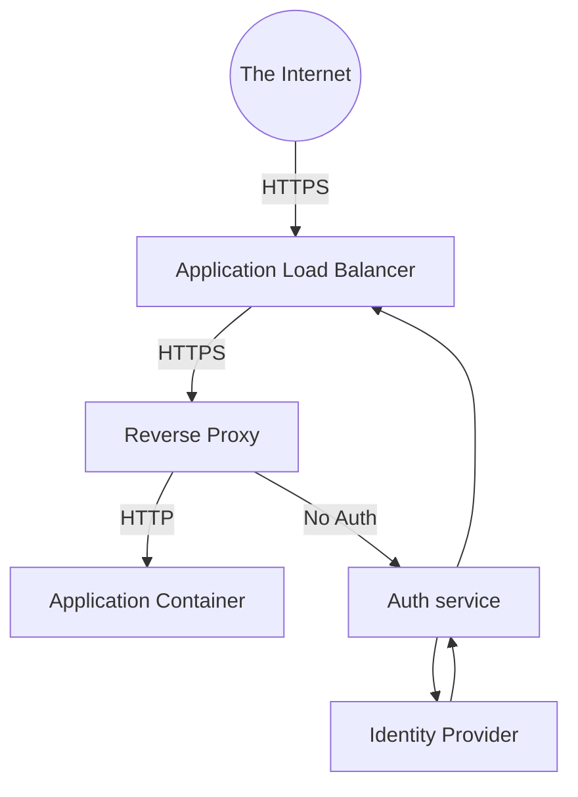

# mermaid-render-test

```mermaid
graph
    A((The Internet)) -->|HTTPS| B[Application Load Balancer]
    B -->|HTTPS| C[Reverse Proxy]
    C -->|HTTP| D[Application Container]
    C -->|No Auth| E[Auth service]
    E --> F[Identity Provider]
    F --> E
    E --> B
```
